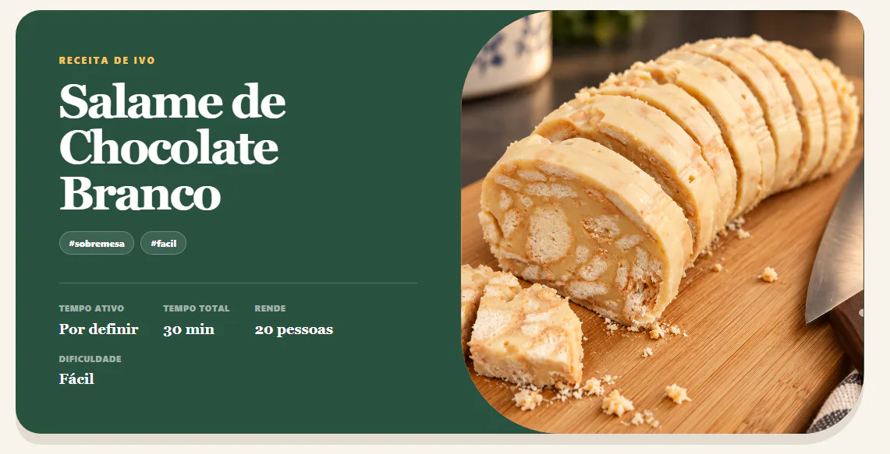
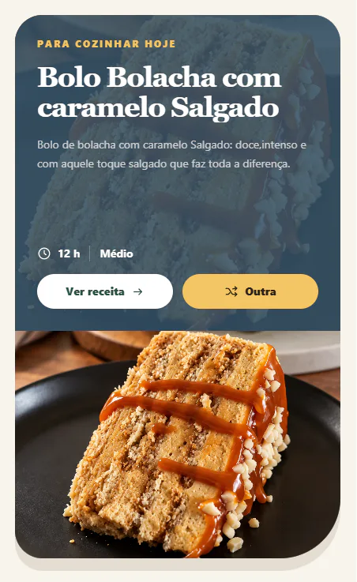
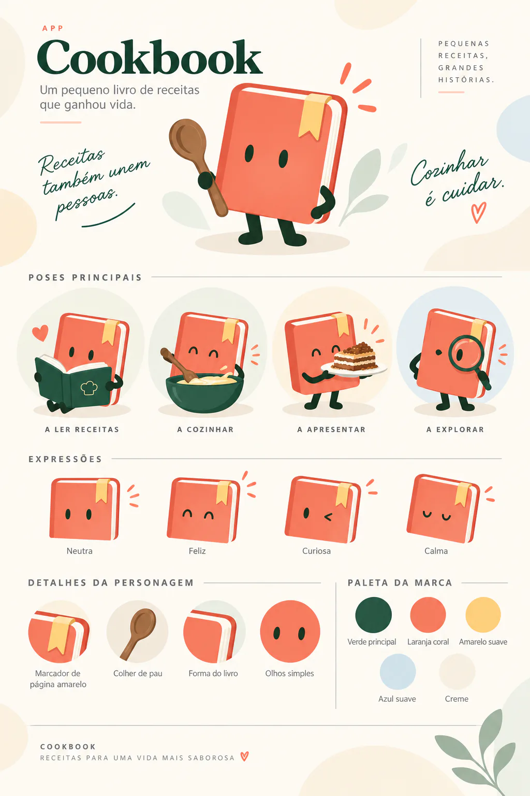

<p align="center">
  
</p>

<h1 align="center">Cookbook</h1>

<p align="center">
  <strong>Pequenas receitas, grandes histórias.</strong><br />
  Um livro de receitas privado, partilhado e feito para cozinhar em conjunto.
</p>

<p align="center">
  <code>mobile first</code> · <code>PWA</code> · <code>PT-PT</code> · <code>tempo real</code>
</p>

---

## Da coleção até à mesa

O Cookbook junta num só lugar as receitas de Ivo e Ana. Foi desenhado primeiro
para telemóvel e tablet, com uma linguagem visual caseira, editorial e prática.

<table>
  <tr>
    <td width="68%" align="center">
      
      <br /><sub>Receita completa, fotografia, tempos, doses e autoria.</sub>
    </td>
    <td width="32%" align="center">
      
      <br /><sub>Sugestão diária adaptada à fotografia.</sub>
    </td>
  </tr>
</table>

## O essencial

- coleção partilhada com pesquisa, etiquetas, favoritos e avaliações individuais;
- criação e edição manual, medidas europeias e ajuste das doses por pessoas;
- importação por texto ou ligação, com Gemini como apoio quando a página é difícil de ler;
- fotografias privadas com recorte escolhido pelo utilizador e otimização automática em WebP;
- Modo Cozinhar com passos, ingredientes contextuais, progresso e vários temporizadores;
- sincronização em tempo real, caixote, cópia de segurança e instalação como PWA.

## Chef Pitéu

O Chef Pitéu é a identidade visual e o pequeno anfitrião da aplicação. As suas
poses acompanham a leitura, a descoberta, a cozinha, os estados de carregamento
e os momentos de celebração sem transformar a interface num desenho infantil.

<p align="center">
  
</p>

## Como foi construído

| Camada | Tecnologia |
| --- | --- |
| Interface | Next.js 16, React 19, TypeScript e Tailwind CSS 4 |
| Dados | Supabase Postgres, Auth, Realtime e Storage privado |
| Validação e imagem | Zod e Sharp |
| Importação assistida | Google Gemini, usado apenas como fallback ou revisão explícita |

```text
web/
├── src/app/          páginas, rotas e ações de servidor
├── src/components/   interface reutilizável
├── src/lib/          domínio, importação e clientes Supabase
└── supabase/         schema, políticas RLS e configuração de Storage
```

<details>
<summary><strong>Executar localmente</strong></summary>

É necessário Node.js 20.9 ou superior e um projeto Supabase dedicado.

```powershell
cd web
npm install
Copy-Item .env.example .env.local
npm run dev
```

Preencher `.env.local` sem o adicionar ao Git:

```dotenv
NEXT_PUBLIC_SUPABASE_URL=https://SEU-PROJETO.supabase.co
NEXT_PUBLIC_SUPABASE_PUBLISHABLE_KEY=SUA_CHAVE_PUBLICA
GEMINI_API_KEY=SUA_CHAVE_PRIVADA_DO_GOOGLE_AI_STUDIO
```

As instruções para criar a base de dados estão em
[`web/supabase/README.md`](./web/supabase/README.md).

</details>

## Verificação

```powershell
cd web
npm run lint
npm test
npm run build
```

O guia completo para publicar na Vercel e ligar um subdomínio da OVH está em
[`docs/DEPLOYMENT.md`](./docs/DEPLOYMENT.md).

---

<p align="center"><em>Receitas também unem pessoas. Cozinhar é cuidar.</em></p>
